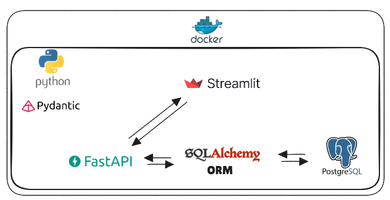
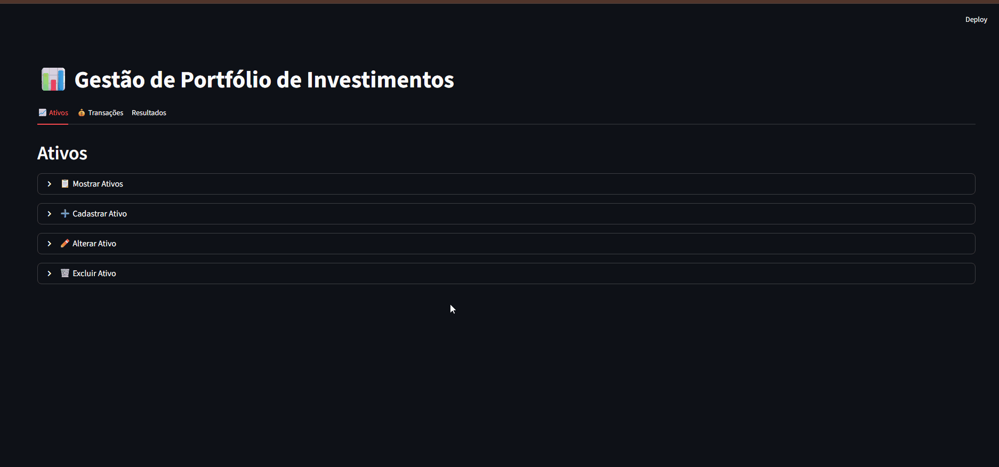

# 📊 Gerenciador de Portfólio de Ativos
Este projeto é uma aplicação para controle de ativos financeiros, onde é possível:

- Cadastrar ativos

- Registrar transações de compra e venda

- Visualizar posição líquida atual

- Consultar lucro realizado com operações já encerradas

## ⚙️ Tecnologias Utilizadas
- Python 3.13+

- FastAPI (API backend)

- Pydantic (Validação de dados)

- SQLAlchemy (ORM)

- PostgreSQL (banco de dados)

- Streamlit (frontend)

- Docker & Docker Compose (containerização)

## ▶️ Como rodar o projeto
### 1. Clonar o repositório
```bash
git clone https://github.com/luanmaieski/portfolio_investimentos.git
cd portfolio_investimentos
```
### 2. Subir os containers
```bash
docker-compose up --build
```
### 3. Acessar a aplicação
- Interface Streamlit → http://localhost:8501

- Docs da API (Swagger) → http://localhost:8000/docs

## 📂 Estrutura do Projeto
```bash
.
├── backend/              # Código do FastAPI (API, models, schemas, crud, routers, Dockerfile)
├── frontend/             # Código do Streamlit (app, requirements, Dockerfile)
├── docker-compose.yml    # Orquestração dos containers
└── README.md             # Documentação do projeto
```
## Arquitetura

## Prévia do Frontend


## 📌 Próximos Passos (possíveis melhorias)
- Autenticação de usuários

- Integração com APIs de cotações em tempo real

- Relatórios exportáveis (Excel / PDF)